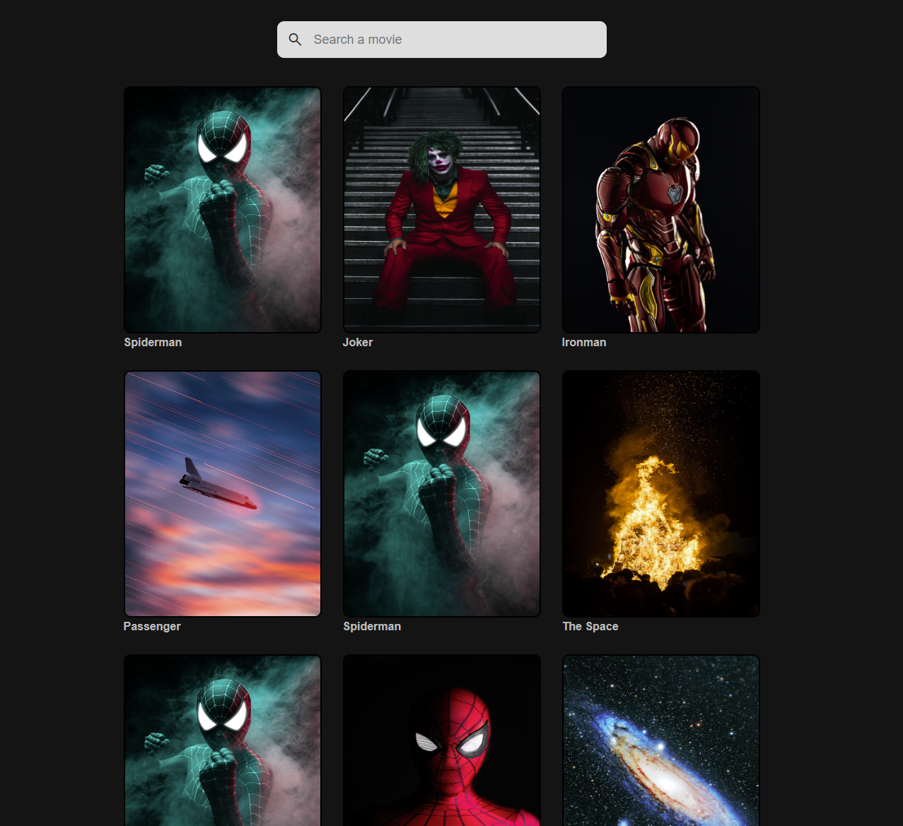

# Image gallery

> A simple website that allows user to search for movies.

## Table of contents

- [Image gallery](#image-gallery)
  - [Table of contents](#table-of-contents)
  - [General info](#general-info)
  - [Screenshots](#screenshots)
  - [Technologies](#technologies)
  - [Setup](#setup)
  - [Code Examples](#code-examples)
  - [Status](#status)

## General info

> The objective of the project is to practice separation of concern in
> JavaScript.

## Screenshots



## Technologies

- JavaScript
- HTML5
- CSS3
- VSC code

## Setup

Clone the repo and run npm install.

## Code Examples

```js
const loadHandler = () => {
	data.images.forEach((image) => {
		const imageBox = createImage(image);
		dom.images.append(imageBox);

		//save my images
		data.posters.push({
			id: image.id,
			dom: imageBox,
			title: image.title,
		});
	});
};
```

## Status

Project is: _done_
